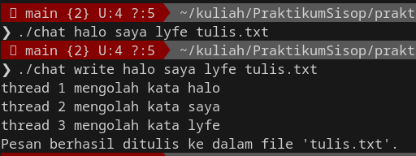
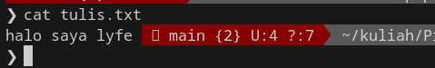
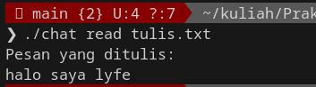
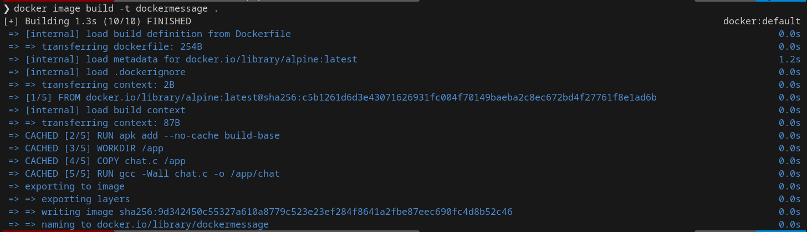
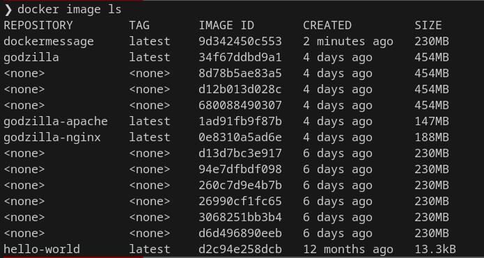

[](https://classroom.github.com/a/jYae_yK9)
<div align=center>

|    NRP     |      Name      |
| :--------: | :------------: |
| 5025221203 | Muhammad Choirun Ni'am|
| 5025221193 | Alief Gilang Permana Putra |

# Praktikum Modul 3 _(Module 3 Lab Work)_

</div>

### Daftar Soal _(Task List)_

- [Task 1 - Jess No Limit Push Rank](/task-1/)

- [Task 2 - BNBWT](/task-2/)

- [Task 3 - Volume Expansion](/task-3/)

- [Task 4 - WOTA Competition](/task-4/)

# Laporan Resmi Praktikum Modul 3 _(Module 3 Lab Work Report)_

## 1. Jess No Limit Push Rank

Jess No Limit sudah siap untuk comeback ke dunia professional esport Mobile Legend. Dia sudah bersusah payah untuk pushrank hingga ke Mythic Immortal dan membuktikan ke dunia bahwa dia adalah pemain yang paling handal. Ketika dia dan timnya kembali latihan, mereka kesulitan untuk menentukan role yang cocok bagi Jess No Limit. Mereka butuh bantuan kalian dalam hal ini, karena hero ML yang begitu banyak pada dataset mobile legend.

- a. Download dataset menggunakan `kaggle datasets download -d irwansyah10010/mobilelegend` setelah berhasil mendownload dengan format file .zip, langkah selanjutnya adalah mengekstrak file tersebut. Kalian melakukannya di dalam file [ayamgoreng.c](./ayamgoreng.c) untuk semua pengerjaannya

- b. Jess No Limit ingin mengetahui hero apa saja yang terbaik dari setiap role yang ada dengan perhitungan seperti berikut:

  |   Role   |        Rumus Skillpoints        |
  | :------: | :-----------------------------: |
  |   Tank   |               HP                |
  | Assassin |         Physical Attack         |
  | Fighter  |      HP + Physical Attack       |
  | Marksman | Physical Attack \* Attack Speed |
  |   Mage   |        Mana / Mana Regen        |
  | Support  |         Mana Regen + HP         |

  `ayamgoreng.c` harus bisa **mengoutputkan semua hero yang terbaik pada setiap role secara default tanpa argumen**, namun juga bisa menampilkan sesuai dengan **role yang diberikan pada argumen** pada saat pemanggilan program (`./ayamgoreng [role]`). Data hero beserta rolenya dapat dilihat pada file identitas.csv, sedangkan data hero beserta atributnya dapat dilihat pada file atribut-hero.csv. Keluarkan informasi mengenai hero dan skillpointsnya dengan format `Hero terbaik adalah (nama hero) dengan skillpoint (jumlah skillpoint)`.

- c. Jess No Limit menyadari bahwa sistem kalian sangat berguna dan ingin sistem ini bisa diakses oleh teman satu timnya. Oleh karena itu, kalian perlu menjadikan sistem yang dibuat ke sebuah Docker Container agar mudah di-distribute dan dijalankan di lingkungan lain tanpa perlu setup environment dari awal. Buatlah Dockerfile yang berisi semua langkah yang diperlukan untuk setup environment dan menentukan bagaimana aplikasi harus dijalankan.

  Setelah sukses membuat sistem berbasis Docker, Jess No Limit merasa bahwa sistem ini tidak hanya berguna untuk dirinya sendiri, tetapi juga akan akan membantu para fansnya yang terpencar di seluruh dunia dalam merekrut pemain berpotensi tinggi. Namun, satu tantangan muncul, yaitu bagaimana caranya para fans dapat mengakses dan menggunakan sistem yang telah diciptakan?

- d. Merasa terpanggil untuk membantu Jess No Limit lebih jauh, kalian memutuskan untuk mem-publish Docker Image sistem ke Docker Hub, sebuah layanan cloud yang memungkinkan kalian untuk membagikan aplikasi Docker kalian ke seluruh dunia. Output dari pekerjaan ini adalah file Docker kalian bisa dilihat secara public pada `https://hub.docker.com/r/{Username}/joki-ml-bang`.

- e. Melihat betapa banyaknya fans Jess No Limit, kalian diminta untuk menerapkan skala pada layanan menggunakan **Docker Compose** dengan instance sebanyak 6 (untuk setiap role). Pastikan setiap instance memanggil program untuk menampilkan hero terbaik sesuai dengan role yang diberikan pada argumen. Penamaan setiap instance sama dengan role yang akan ditampilkan (instance mage, instance fighter, dst).

### Notes

- Pada poin c, command yang dijalankan pada docker file tidak terdapat argumen dan akan menampilkan semua role


### Jawaban
Membuat file bernama storage.c untuk mendownload datasets dengan menggunakan command berikut:

```c
kaggle datasets download -d bryanb/fifa-player-stats-database
```

#### 1.1.1 Install Kaggle

Hal pertama yang perlu dilakukan pada penyelesaian soal ini adalah melakukan install kaggle dengan menggunakan command berikut:

```command
pip install kaggle
```

Jika belum menginstall pip, maka install dulu dengan menggunakan command berikut:

```command
sudo apt install python3-pip
```

Kemudian, membuat akun kaggle di https://www.kaggle.com/ dan mendownload file kaggle.json yang berisi API key.


Setelah berhasil, langkah selanjutnya menggunakan command berikut:

```command
mkdir -p ~/.kaggle
mv /home/cchoirun/Downloads/kaggle.json ~/.kaggle/
```

Kemudian menjalankan command berikut untuk melindungi API key yang telah didownload tadi

```command
chmod 600 ~/.kaggle/kaggle.json
```

Kaggle pun selesai diinstall.

#### 1.1.1 Download Datasets

**Code**

```c
    int dataset = system("kaggle datasets download -d irwansyah10010/mobilelegend");
```

**Penjelasan**

- `int dataset = system("kaggle datasets download -d irwansyah10010/mobilelegend"); ` mendeskripsikan kaggle dataset yanga akan didownload menggunakan system()

#### 1.1.2 Ekstrak File

**Code**

```c
void extract(char file[]){
    char cmd[100];
    snprintf(cmd, sizeof(cmd), "unzip %s", file);
    system(cmd);

}


```

**Penjelasan**

- `unzip %s` dimana `%s` akan digantikan dengan nilai parameter folder
- `system(command);` untuk mengeksekusi perintah yang disimpan dalam variable cmd

  
#### 1.1.3 Membuat struct Hero
```c
typedef struct 
{
  
  char name[50];
  char role[50];
  char type[50];
  int year;
  char hp[50];
  char physicalAttack[50];
  char attackSpeed[50];
  char mana[50];
  char manaRegen[50];

} Hero;
```

#### 1.1.4 Menghitung skillpoint
```c
double calculateSkillPoints(Hero hero) {
    
    if (strstr(hero.role, "TANK") != NULL) {
        return atof(hero.hp);
    } else if (strstr(hero.role, "ASSASSIN") != NULL) {
        return atof(hero.physicalAttack);
    } else if (strstr(hero.role, "FIGHTER") != NULL) {
        return atof(hero.hp) + atof(hero.physicalAttack);
    } else if (strstr(hero.role, "MM") != NULL) {
        return atof(hero.physicalAttack) * atof(hero.attackSpeed);
    } else if (strstr(hero.role, "MAGE") != NULL) {
        return atof(hero.mana) / atof(hero.manaRegen);
    } else if (strstr(hero.role, "SUPPORT") != NULL) {
        return atof(hero.manaRegen) + atof(hero.hp);
    } else {
        return -1; // Role tidak valid
    }
}
```

#### 1.1.5 Mencari hero terbaik
```c
void findBestHeroes(Hero *heroes, int numHeroes) {
    // Iterasi untuk setiap role
    char roles[6][20] = {"TANK", "ASSASSIN", "FIGHTER", "MM", "MAGE", "SUPPORT"};
    for (int i = 0; i < 6; i++) {
        int maxSkillPoints = 0;
        char bestHero[50];

        // Iterasi untuk setiap hero dengan role tertentu
        for (int j = 0; j < numHeroes; j++) {
            if (strcmp(heroes[j].role, roles[i]) == 0) {
                int skillPoints = calculateSkillPoints(heroes[j]);
                if (skillPoints > maxSkillPoints) {
                    maxSkillPoints = skillPoints;
                    strcpy(bestHero, heroes[j].name);
                }
            }
        }

        // Menampilkan hero terbaik dari setiap role
        printf("Hero terbaik untuk role %s adalah %s dengan skillpoint %d.\n", roles[i], bestHero, maxSkillPoints);
    }
}
```
Hasil outputan dari file ayamgoreng.c akan mengeluarkan hero-hero dengan skill terbaik dan apabila kita berikan argumen maka akan mengoutputkan hero dengan argumen tersebut. 


### 1.3 Membuat Dockerfile dan Menjalankannya

#### 1.3.1 Buat Dockerfile

**Code**

```dockerfile
# Base image
FROM ubuntu:latest

# Install dependencies
RUN apt-get update && apt-get install -y python3-pip gcc unzip

# Install kaggle CLI
RUN pip3 install kaggle

# Generate Kaggle
RUN mkdir -p /root/.kaggle && \
    echo '{"username":"melanierefman","key":"5faab516559d2fc857b9862273bea193"}' > /root/.kaggle/kaggle.json && \
    chmod 600 /root/.kaggle/kaggle.json

# Set working directory
WORKDIR /app

# Copy the storage.c file
COPY storage.c /app/storage.c

# Install gcc compiler
RUN apt-get update && apt-get install -y build-essential

# Compile the storage.c file
RUN gcc -o storage storage.c

# Set executable permissions
RUN chmod +x storage

# Run the storage program
CMD ["./storage"]
```

**Penjelasan**

- `FROM ubuntu:latest`untuk mengambil base image Ubuntu terbaru sebagai dasar untuk membangun Docker Image
- `RUN apt-get update && apt-get install -y python3-pip gcc unzip` menggunakan `RUN` untuk menjalankan beberapa perintah dalam container. Di sini, `apt-get update` digunakan untuk memperbarui daftar paket apt-get, dan `apt-get install -y` digunakan untuk menginstal beberapa dependensi yang dibutuhkan, yaitu `python3-pip`, `gcc`, dan `unzip`
- `RUN mkdir -p ...` untuk membuat direktori /root/.kaggle dan mengatur izinnya. Selanjutnya, baris ini juga membuat file kaggle.json di dalam direktori tersebut dan mengatur izinnya. File kaggle.json berisi informasi otentikasi Kaggle API untuk mengunduh dataset.
- `WORKDIR /app` untuk mengatur direktori kerja (working directory) dalam kontainer Docker menjadi `/app`
- `COPY ayamgoreng.c /app/ayamgoreng.c ` untuk menyalin file ayamgoreng.c dari direktori lokal (host) ke direktori `/app` dalam container.
- `RUN apt-get update && apt-get install -y build-essential` untuk memperbarui daftar paket apt-get dan menginstal paket build-essential. Paket build-essential berisi alat-alat yang diperlukan untuk mengompilasi kode C.
- `RUN gcc ayamgoreng.c -o ayamgoreng` untuk mengompilasi file ayamgoreng.c menjadi file biner storage menggunakan compiler GCC
- `RUN chmod +x ayamgoreng` untuk untuk mengatur izin eksekusi (+x) pada file ayamgoreng
- `CMD ["./ayamgoreng"]` untuk menentukan perintah default yang akan dijalankan saat container dijalankan.

#### 1.2 Build Dockerfile

Untuk menjalankan dockerfile yang sudah dibuat, maka perlu membuat akun Docker Hub pada https://hub.docker.com/ dan login ke akun tersebut dengan menggunakan command berikut:

```command
docker login
```

Kemudian menjalankan command berikut:

```command
docker build -t dockerfile .
```

`docker build` digunakan untuk membangun Docker Image. Opsi `-t` digunakan untuk memberikan tag pada Image yang akan dibangun. `dockerfile` merupakan nama Image `menunjukkan bahwa Dockerfile yang akan digunakan berada di direktori saat ini.

Docker Image berhasil di build.


Selanjutnya, menjalankan command berikut:

```command
docker run dockerfile
```

Command ini digunakan untuk menjalankan sebuah container berdasarkan Image yang telah dibuat sebelumnya dengan nama `dockerfile`.

Container berhasil di run.
### 1.3 Publish Docker Image

Pada soal diminta untuk mem-publish Docker Image sistem ke Docker Hub.

#### 1.3.2 Login Akun Docker Hub

#### 1.3.2 Push Docker Image

Untuk push Docker Image dapat menggunakan command berikut:

```command
docker push dockerfile
```


Docker Image berhasil di push.


### 1.5 Docker Compose

Pada soal diminta untuk menggunakan Docker Compose dengan instance sebanyak 5 di 2 direktori yaitu Barcelona dan Napoli.

#### 1.5.1 Membuat Direktori

Untuk membuat direktori, menggunakan command berikut:

```command
mkdir bestHero
```

#### 1.5.2 Membuat Docker Compose

**Code**

```docker-compose

version: '3'

services:
  tank:
    image: cchoirun/joki-ml-bang:v1
    command: ./ayamgoreng TANK
    deploy:
      replicas: 6

  assassin:
    image: cchoirun/joki-ml-bang:v1
    command: ./ayamgoreng ASSASSIN
    deploy:
      replicas: 6

  fighter:
    image: cchoirun/joki-ml-bang:v1
    command: ./ayamgoreng FIGHTER
    deploy:
      replicas: 6

  marksman:
    image: cchoirun/joki-ml-bang:v1
    command: ./ayamgoreng MM
    deploy:
      replicas: 6

  mage:
    image: cchoirun/joki-ml-bang:v1
    command: ./ayamgoreng MAGE
   `deploy:
      replicas: 6

  support:
    image: cchoirun/joki-ml-bang:v1
    command: ./ayamgoreng SUPPORT
    deploy:
      replicas: 6
```

### 2. Jawaban
Di file client.c : 
```c
typedef struct {
    char username[100];
    char containerName[100];
    char imageName[100];
    char command[200];
    char volume[200];
} ServiceRequest;
```
Pertama, kita buat struct bernama ServiceRequest yang akan menyimpan variabel username, container name, image name, command, dan volume.

```c
int sock = 0;
    struct sockaddr_in serv_addr;
    ServiceRequest request;

    if ((sock = socket(AF_INET, SOCK_STREAM, 0)) < 0) {
        printf("\n Kesalahan pembuatan socket \n");
        return -1;
    }

    serv_addr.sin_family = AF_INET;
    serv_addr.sin_port = htons(PORT);

    if (inet_pton(AF_INET, "127.0.0.1", &serv_addr.sin_addr) <= 0) {
        printf("\nAlamat tidak valid/Alamat tidak didukung \n");
        return -1;
    }

    if (connect(sock, (struct sockaddr *)&serv_addr, sizeof(serv_addr)) < 0) {
        printf("\nKoneksi Gagal \n");
        return -1;
    }
```
`socket(AF_INET, SOCK_STREAM, 0)`
Keterangan
- AF_INET: Menunjukkan bahwa socket akan digunakan untuk komunikasi melalui protokol internet (IPv4).
- SOCK_STREAM: Menentukan bahwa socket akan bekerja dalam mode connection-oriented (seperti TCP) yang menjamin pengiriman data secara berurutan dan handal.
- 0: Digunakan untuk memilih protokol default berdasarkan domain dan tipe socket (dalam hal ini, TCP).

```c
printf("Masukkan nama pengguna (ketik 'exit' untuk keluar): ");
    scanf("%s", request.username);
    if (strcmp(request.username, "exit") == 0 || strcmp(request.username, "quit") == 0) {
        printf("Keluar...\n");
        close(sock);
        return 0;
    }
    send(sock, request.username, strlen(request.username), 0);
```
Disini kita akan memasukkan nama pengguna 
```c
 while (1) {
        printf("Masukkan nama container: ");
        scanf("%s", request.containerName);
        printf("Masukkan nama gambar: ");
        scanf("%s", request.imageName);
        printf("Masukkan perintah awal: ");
        scanf(" %[^\n]%*c", request.command);
        printf("Masukkan volume: ");
        scanf("%s", request.volume);

        send(sock, &request, sizeof(ServiceRequest), 0);

        printf("Permintaan layanan telah dikirim.\n");

        printf("Masukkan layanan lain atau ketik 'exit' untuk keluar: ");
        scanf("%s", request.username);
        if (strcmp(request.username, "exit") == 0 || strcmp(request.username, "quit") == 0) {
            printf("Keluar...\n");
            break;
        }
    }
```
Disini kita melakukan perulangan untuk menginputkan nama container, nama gambar, perintah awal dan volume, kemudian kita kirim socketnya ke file server.c


#### Di file server.c
```c
typedef struct {
    char username[100];
    char containerName[100];
    char imageName[100];
    char command[200];
    char volume[200];
} ServiceRequest;
```
Pertama kita membuat struct bernama serviceRequest yang gunanya untuk menangkap pesan-pesan dari client berupa username, containerName, imageName, command, dan volume.

```c
void runDockerCompose() {
    // Menjalankan Docker Compose
    int pid = fork();
    if (pid == 0) {
        execlp("docker-compose", "docker-compose", "-f", "docker-compose.yml", "up", "--force-recreate", NULL);
        perror("Gagal menjalankan docker-compose");
        exit(EXIT_FAILURE);
    }
    wait(NULL);  // Tunggu docker-compose selesai
    printf("Docker Compose telah dijalankan.\n");
}
``` Di fungsi runDockerCompose() ini kita akan menjalankan docker compose dengan membuat fork(). Fungsi untuk menjalankan Docker Compose dengan konfigurasi yang ada di file docker-compose.yml.

```c
int server_fd, client_sock, opt = 1;
    struct sockaddr_in address;
    int addrlen = sizeof(address);
    int max_clients, i;
    ServiceRequest services[5];  // Asumsi maksimal 5 klien
    char buffer[1024] = {0};
    FILE *fp;

    printf("Masukkan jumlah klien yang akan dilayani (1-5): ");
    scanf("%d", &max_clients);

    printf("Masukkan nama pengguna yang valid:\n");
    char* valid_usernames[max_clients];

    for (i = 0; i < max_clients; i++) {
        valid_usernames[i] = malloc(100 * sizeof(char));
        printf("Username %d: ", i + 1);
        scanf("%s", valid_usernames[i]);
    }
```
Kita mendefinisikan semua variabel yang dibutuhkan yaitu address, addrlen, *fp, dll.

```c
  if ((server_fd = socket(AF_INET, SOCK_STREAM, 0)) == 0) {
        perror("Gagal membuat soket");
        exit(EXIT_FAILURE);
    }

    if (setsockopt(server_fd, SOL_SOCKET, SO_REUSEADDR | SO_REUSEPORT, &opt, sizeof(opt))) {
        perror("setsockopt");
        exit(EXIT_FAILURE);
    }
```
Ini digunakan untuk mengecek ketika socket dapat berjalan dengan benar, dan akan menampilkan pesan error jika tidak bisa dijalankan.

```c
 address.sin_family = AF_INET;
    address.sin_addr.s_addr = INADDR_ANY;
    address.sin_port = htons(PORT);

    if (bind(server_fd, (struct sockaddr *)&address, sizeof(address)) < 0) {
        perror("Gagal melakukan bind");
        exit(EXIT_FAILURE);
    }

    if (listen(server_fd, max_clients) < 0) {
        perror("listen");
        exit(EXIT_FAILURE);
    }
```
Kita menggunakan AF_INET untuk ip address v4 dan mengecek bind server, ketika gagal melakukan bind maka akan memberikan pesan error.

```c
 while (1) {
        for (i = 0; i < max_clients; i++) {
            if ((client_sock = accept(server_fd, (struct sockaddr *)&address, (socklen_t*)&addrlen)) < 0) {
                perror("accept");
                exit(EXIT_FAILURE);
            }
            int found = 0;
            read(client_sock, buffer, 1024);  // Baca nama pengguna dari klien
            for (int j = 0; j < max_clients; j++) {
                if (strcmp(buffer, valid_usernames[j]) == 0) {
                    found = 1;
                    read(client_sock, &services[i], sizeof(ServiceRequest));
                    printf("Permintaan layanan diterima dari %s\n", services[i].username);
                    break;
                }
            }
            if (!found) {
                send(client_sock, "INVALID", strlen("INVALID"), 0);
                i--;  // Kurangi hitungan untuk mencoba nama pengguna yang valid lagi
            }
        }

        fp = fopen("docker-compose.yml", "w");
        fprintf(fp, "version: '3'\nservices:\n");
        for (i = 0; i < max_clients; i++) {
            fprintf(fp, "  %s:\n", services[i].containerName);
            fprintf(fp, "    image: %s\n", services[i].imageName);
            fprintf(fp, "    command: %s\n", services[i].command);
            fprintf(fp, "    volumes:\n");
            fprintf(fp, "      - %s\n", services[i].volume);
        }
        fclose(fp);
        runDockerCompose();
    }

    for (i = 0; i < max_clients; i++) {
        free(valid_usernames[i]);
    }
```
Keterangan

- for (i = 0; i < max_clients; i++) { ... }: Iterasi untuk menangani beberapa klien secara bersamaan (hingga max_clients).
- client_sock = accept(server_fd, ...): Menerima koneksi dari klien. server_fd adalah deskriptor socket server, dan informasi klien akan disimpan di address.
- read(client_sock, buffer, 1024);: Membaca nama pengguna yang dikirimkan oleh klien ke dalam buffer.
- for (int j = 0; j < max_clients; j++) { ... }: Iterasi untuk memeriksa apakah nama pengguna yang diterima (buffer) valid. Daftar nama pengguna valid disimpan di valid_usernames.
Jika nama pengguna valid:
- read(client_sock, &services[i], sizeof(ServiceRequest)): Membaca detail permintaan layanan (ServiceRequest) dari klien.
- printf(...): Menampilkan pesan bahwa permintaan layanan telah diterima.
Jika nama pengguna tidak valid:
- send(client_sock, "INVALID", ...): Mengirim pesan "INVALID" ke klien untuk menandakan kegagalan validasi.

<<<<<<< HEAD
## 3. Volume Expansion
a. Kita diminta untuk membuat program pada chat.c yang dapat membaca dan menulis pesan pada file tertentu. Untuk membaca file, kita menggunakan fungsi ```readFile``` dengan parameter ```argc``` dan ```*argv[]``` yang di passing dari main program. Kemudian untuk menentukan path file yang dituju kita menggunakan ```argv[argc-1]``` karena sesuai dengan instruksi soal, path file diletakkan pada argumen terakhir dan kemudian disimpan dalam variabel pointer ```*fpath```. Lalu kita buka file menggunakan ```fopen(fpath,"r")``` yaitu membuka file dengan mode baca. Lalu kita baca isi file tersebut dengan kode berikut :
```c
    while(fgets(buff,128,fp)!=NULL){
        if(ferror(fp)) {
            perror("Error while reading file");
            fclose(fp);
            return;
        }
        else printf("%s",buff);
    };
```
Kode ini melakukan loop hingga ```fgets``` bernilai NULL yang berarti isi file telah selesai dibaca. Kita membaca file per batch dengan ukuran baca per batch adalah 128 karakter kemudian kita outputkan. Setelah selesai dibaca, maka kita tutup file dengan ```fclose(*fp)```.

Untuk melakukan write kita diminta untuk melakukannya dalam bentuk satu thread per kata, sehingga kita memerlukan dua fungsi yaitu ```void *writeBatch(void *arg)``` adalah fungsi yang berjalan sebagai thread dan ```void writeFile(int argc, char *argv[])``` sebagai fungsi utama yang dipanggil oleh main program. Selain itu kita juga memerlukan mutex agar tidak terjadi race condition serta menjaga integritas data. Langkah pertama adalah mendefinisikan struct 
```c
struct writeBatchData{
    int threadNum;
    char *wordToWrite;
    FILE *pointerFile;
};
```
struct ini berfungsi sebagai struktur data yang digunakan pada fungsi ```writeBatch``` pada thread sebagai parameter. ```threadNum``` digunakan untuk menyimpan informasi nomor thread, ```wordToWrite``` merupakan pointer yang merujuk pada kata yang akan ditulis, dan ```pointerFile``` merupakan pointer yang merujuk pada file dimana ```wordToWrite``` akan ditulis. Kemudian kita mendefinisikan fungsi ```writeBatch```
```c
void *writeBatch(void *arg) { 
    pthread_mutex_lock(&mutex);
    struct writeBatchData *dataParam;
    dataParam = (struct writeBatchData *) arg;
    
    fputs(dataParam->wordToWrite,dataParam->pointerFile);
    fputs(" ",dataParam->pointerFile);
    printf("thread %d mengolah kata %s\n",dataParam->threadNum,dataParam->wordToWrite);
    pthread_mutex_unlock(&mutex);
}
```

Pada awal program, kita mendefinisikan terlebih dahulu variabel mutex global yang akan digunakan pada fungsi ini. Kemudian untuk setiap pemanggilan fungsi ini, maka variable mutex akan di lock agar thread lain tidak mengakses pointer file yang digunakan oleh proses ini. Kemudian kita akan menyimpan parameter ```arg``` yang telah diformat sesuai struct ```writeBatchData``` pada variabel ```dataParam```. Selanjutnya kita akan menulis kata menggunakan ```fputs``` berdasarkan informasi yang terdapat pada ```dataParam```. Lalu kita outputkan nomor thread dan kata yang ditulis dengan thread ini menggunakan ```printf```. Langkah terakhir adalah kita unlock variabel ```mutex``` agar dapat digunakan oleh thread selanjutnya. 
Program utama ```writeFile``` adalah sebagai berikut :
```c
void writeFile(int argc, char *argv[]){

    struct writeBatchData dataParamArr[argc-3];
    pthread_t thread[argc-3];
    
    char *fpath = argv[argc-1];
    FILE *fp =fopen(fpath,"a");
    if(fp==NULL) {
        perror("Error opening file: file not exists or permission denied!");
        return;
    }
    
    for(int i=0;i<(argc-3);i++){
        dataParamArr[i].threadNum=i+1;
        dataParamArr[i].wordToWrite=argv[i+2];
        dataParamArr[i].pointerFile=fp;
        pthread_create(&thread[i], NULL, writeBatch, &dataParamArr[i]);
        sleep(0.0000001);
    }
    for(int i=0;i<(argc-3);i++){
        pthread_join(thread[i],NULL);
    }
    fclose(fp);
    printf("Pesan berhasil ditulis ke dalam file \'%s\'.\n",fpath);
}
```

Kita mendefinisikan array ```dataParamArr``` dan ```thread``` untuk menyimpan parameter setiap kata yang akan ditulis dan jumlah thread yang akan dijalankan. Kemudian kita mengambil data file path dari ```argv[argc-1]``` yang telah di passing melalui parameter fungsi sebagai tujuan file yang akan ditulis. Lalu kita akan membuka file dalam mode append agar isi file yang ada sebelumnya tidak hilang. Kemudian kita lakukan loop untuk mengisi array ```dataParamArr``` dengan data untuk setiap kata yang akan ditulis sekaligus membuat thread dengan memanggil fungsi ```writeBatch```. Pada akhir setiap loop kita gunakan ```sleep(0.0000001)``` agar fungsi thread berjalan berurutan sesuai dengan nomor loop dengan menjeda sejenak eksekusi loop selanjutnya. Setelah semua thread selesai dibuat, maka kita gunakan ```pthread_join``` untuk menunggu seluruh eksekusi thread selesai sebelum program utama berjalan kembali. Setelah semua thread dieksekusi, maka kita tutup file dengan ```fclose``` dan outputkan bahwa pesan telah berhasil ditulis.

Main program :
```c
int main(int argc, char *argv[]){
    
    pthread_mutex_init(&mutex,NULL);
    if(argc<3){
        printf("More argument required!\n");
        return 1;
    }
    else{
        if(strcmp(argv[1],"read")==0) {
            readFile(argc, argv);
        }
        else if(strcmp(argv[1],"write")==0) {
            writeFile(argc, argv);
        }
        else printf("No command specified!\n");
    }   
}
```
Main program berfungsi sebagai program interaktif dan juga untuk mengecek apakah program dijalankan sesuai dengan parameter yang ditentukan.

Eksekusi program :





b. Pada soal ini kita diminta untuk membuat docker images yang memuat program pada soal a. Berikut adalah isi dockerfile:
```docker
FROM alpine

LABEL name=dockermessage

RUN apk add --no-cache build-base

WORKDIR /app

COPY chat.c /app

RUN gcc -Wall chat.c -o /app/chat

CMD ["/bin/sh"]
```

Pada dockerfile ini kita membuat image dengan base alpine, kemudian kita memberi nama image dengan ```dockermessage``` pada command ```LABEL```. Lalu untuk melakukan compile program C kita perlu menginstal package build-base melalui command ```RUN apk add --no-cache build-base```. Agar struktur kontainer lebih rapi, maka kita akan menaruh file ```chat.c``` pada direktori ```/app```. Selanjutnya kita lakukan kompilasi program ```chat.c``` menggunakan command ```RUN gcc -Wall chat.c -o /app/chat```. Terakhir kita akan memanggil ```/bin/sh``` pada awal pembuatan kontainer agar terdapat proses yang berjalan di dalam kontainer sehingga kontainer tidak terhenti. Untuk melakukan build image kita dapat menggunakan command ```docker build -t dockermessage .``` Berikut hasil eksekusinya :




c. Pada soal ini kita diminta untuk membuat program ```pengaturan.c``` yang dapat melakukan manipulasi kontainer pada docker. Berikut adalah implementasinya:
```c
int main(int argc, char *argv[]){
    pid_t child;
    char dockerImages[] = "dockermessage";
    if(argc==2 && strcmp(argv[1],"list")==0){
        execlp("docker","docker","ps", NULL);
    }
    else {
        if(argc==3){
            if(strcmp(argv[1],"create")==0){
                execlp("docker", "docker", "run","-d","-t","--name", argv[2], dockerImages, NULL);
            }
            else if(strcmp(argv[1],"delete")==0){    
                child = fork();
                if(child==0) execlp("docker","docker","stop",argv[2],NULL);
                else {
                    wait(NULL);
                    execlp("docker","docker","rm","-f",argv[2],NULL);
                }    
            }
            else if(strcmp(argv[1],"login")==0){
                execlp("docker","docker","exec","-it",argv[2],"/bin/sh",NULL);
            }
        }   
        else printf("Unmatched number of argument!\n");
    }
}
```
Pada program ini, apabila diberikan command ```list``` maka program akan memanggil ```docker ps``` dengan ```execlp```. Output yang dihasilkan adalah container yang sedang berjalan saat ini. Apabila diberikan command ```create xxx``` maka program akan memanggil command ```docker run -dt --name xxx dockermessage``` dengan xxx adalah nama container. Command ini akan membuat container dalam mode detached dan attach pseudo-TTY pada container sehingga container akan terus berjalan . Apabila diberikan command ```delete``` maka diperlukan dua command yaitu menghentikan container yang berjalan dan menghapus container sehingga kita memakai ```fork()```, apabila child process maka akan dipanggil command ```docker stop xxx``` terlebih dahulu, lalu parent program akan berjalan dan memanggil command ```docker rm -f xxx``` untuk menghapus container ```xxx``` dari sistem docker. ```-f``` digunakan sebagai opsi untuk menghapus paksa kontainer. Apabila diberikan command ```login```, maka program akan memanggil command ```docker exec -it xxx /bin/sh```. Command ini berfungsi untuk mengeksekusi program ```/bin/sh``` pada container ```xxx``` dengan mode interactive dan attach pseudo-TTY sehingga kita dapat berinteraksi dengan container layaknya terminal biasa.

Hasil eksekusi program :


### Nomor 4

Tentu, mari kita parafrasekan instruksi dan penjelasan program yang Anda berikan:

**Instruksi Tugas:**

1.  **Akses dan Unduh Aplikasi:** Unduh aplikasi Laravel yang sedang dikembangkan oleh Shaniz696969 dari tautan Google Drive yang diberikan.
2.  **Buat Container MySQL:** Buat dan jalankan container Docker yang menjalankan MySQL sebagai database relasional untuk aplikasi. Container ini harus berjalan di latar belakang (daemon).
3.  **Buat Container Laravel:** Buat dan jalankan container Docker untuk image aplikasi Laravel yang telah Anda buat. Container ini juga harus berjalan di latar belakang (daemon).
4.  **Hubungkan Container:** Pastikan aplikasi Laravel (backend) dapat berkomunikasi dengan database MySQL yang berjalan di container lain. Gunakan jaringan Docker bernama "shani-net" untuk menghubungkan keduanya.
5.  **Konfigurasi Laravel:** Ikuti panduan dokumentasi Laravel untuk mengatur aplikasi. Pastikan aplikasi dapat diakses di `http://localhost:9090`. Uji endpoint `/api/province` untuk memverifikasi bahwa aplikasi berfungsi dengan baik.

### **Penjelasan Singkat Program:**

### **a. Membuat Image Aplikasi Laravel**

Sebuah Dockerfile digunakan untuk membuat image Docker yang berisi aplikasi Laravel dan semua dependensi yang dibutuhkan. Dockerfile ini melakukan langkah-langkah berikut:

1.  Mulai dari image dasar `php:8.2-apache`.
2.  Instal paket-paket yang diperlukan (misalnya, `libzip-dev`, `git`, `curl`, dll.) dan ekstensi PHP (`zip`, `pdo_mysql`, `mbstring`, dll.).
3.  Tetapkan direktori kerja di dalam container (`/var/www`).
4.  Unduh dan instal Composer (manajer paket PHP).
5.  Unduh aplikasi Laravel dari tautan Google Drive.
6.  Ekstrak file ZIP aplikasi Laravel.
7.  Salin file konfigurasi `.env` ke dalam container.
8.  Instal dependensi PHP menggunakan Composer (`composer install`).
9.  Ekspos port 9090 agar aplikasi dapat diakses dari luar container.
10. Jalankan perintah `php artisan serve` untuk memulai server pengembangan Laravel.

### **b. Menjalankan Container MySQL**

File `docker-compose.yml` digunakan untuk mendefinisikan dan menjalankan container MySQL. Konfigurasi MySQL meliputi:

-   Menggunakan image `mysql:latest` dari Docker Hub.
-   Mengatur password root MySQL (`MYSQL_ROOT_PASSWORD`).
-   Membuat database bernama `laravel` (`MYSQL_DATABASE`).
-   Menggunakan volume `db-data` untuk menyimpan data MySQL secara persisten.
-   Bergabung dengan jaringan `shani-net`.

### **c. Menjalankan Container Aplikasi Laravel**

File `docker-compose.yml` juga digunakan untuk mendefinisikan dan menjalankan container aplikasi Laravel. Konfigurasi Laravel meliputi:

-   Membangun image dari Dockerfile yang ada.
-   Memetakan port 9090 dari container ke port 9090 di host.
-   Mengatur variabel lingkungan untuk koneksi database (`DB_HOST`, `DB_DATABASE`, `DB_USERNAME`, `DB_PASSWORD`).
-   Menentukan dependensi pada container MySQL (`depends_on: db`).
-   Bergabung dengan jaringan `shani-net`.

### **d. Koneksi antar Container**

Jaringan Docker bernama `shani-net` digunakan untuk menghubungkan container MySQL dan container aplikasi Laravel. Aplikasi Laravel dapat mengakses database MySQL menggunakan nama service `db` yang didefinisikan di `docker-compose.yml`.

### **e. Setup dan Pengujian Aplikasi Laravel**

Setelah container berjalan,aplikasi Laravel dikonfigurasi dengan menyalin file `.env.example` ke `.env`, menghasilkan kunci aplikasi, dan menjalankan migrasi database. Aplikasi kemudian dapat diakses di `http://localhost:9090`, dan endpoint `/api/province` diuji untuk memastikan aplikasi berfungsi dengan benar.

